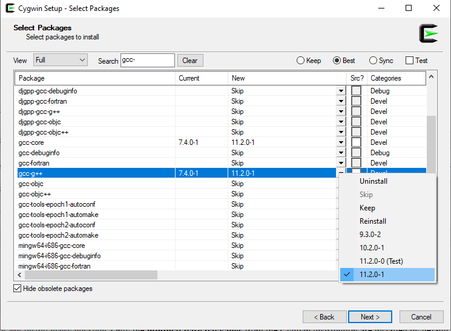
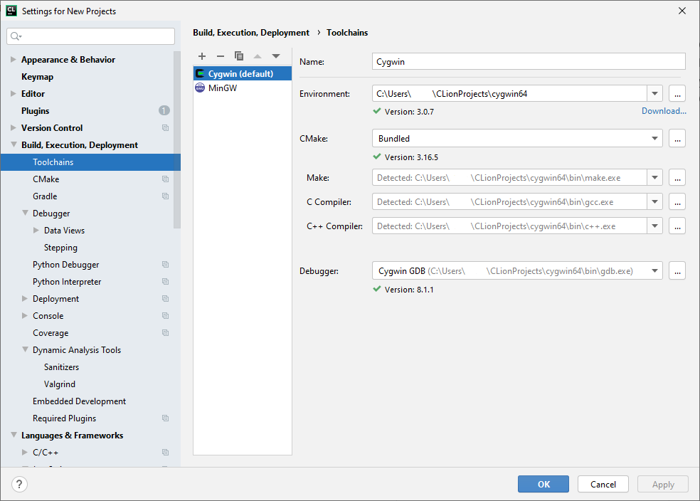
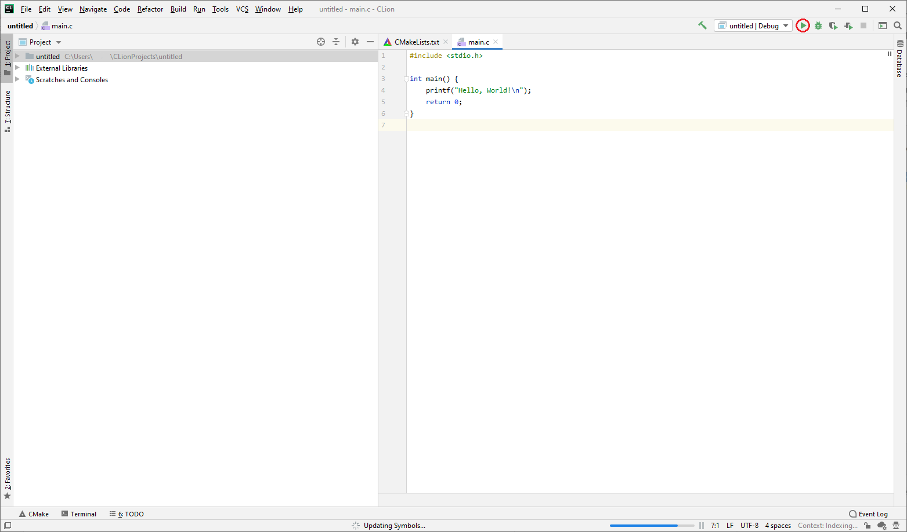

# The C Programming Language
> C has the power of assembly language and the convenience of … assembly language. -- *Dennis Ritchie*

C on Windows is not the best experience but virtualising Unix is not the solution.

1. Open the Jetbrains Toolbox and install [CLion](https://www.jetbrains.com/clion/)
2. Install [Cygwin](https://cygwin.com/install.html), you can either install it `for everyone` (inside a folder like
program files) or `just for you` in a folder in your user area. When installing cygwin you will need to select 
`gcc-g++`, `cmake`, `make`, and `gdb` from the packages list.



3. Open CLion, click configure and then open `Toolchains` under `Build, Execution, Deployment`. Click the small plus
button and select Cygwin, if your environment is not found automatically select the dropdown and find the root of
your cygwin install. Ensure that CMake, Make, C Compiler, and Debugger are all found (either detected or a
small tick mark).



4. Click OK, and then press `New Project`, select C executable from the new project screen with any language standard.
A simple Hello World program should open and if you click the play symbol at the top right it will compile and execute
in a terminal at the bottom of the screen.

```c
#include <stdio.h>

int main() {
    printf("Hello, World!\n");
    return 0;
}

```



## Additional Notes
1. CLion uses CMake to configure running your project. While others are worrying about linking new files to their project
you can simply add it to the `add_executable` section (as shown with `new_file.c` below).

```c
cmake_minimum_required(VERSION 3.16)
project(untitled C)

set(CMAKE_C_STANDARD 99)

add_executable(untitled main.c new_file.c)
```

2. If you ever need to pipe something from C to another program (such as a turtle program) then you can compile your
application with CLion (hammer icon) and then run your executable in PowerShell Core with a pipe operator.

```powershell
> .\your_program.exe | turtle.exe
```

3. If you ever need to access `gcc` directly then you can open the installed `Cygwin Terminal`.

4. If compiling with cygwin via the terminal results in an access denied message you can try disabling your real-time anti-virus scanning.
