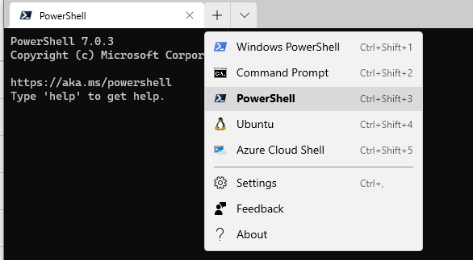

# Windows Getting Started
> Struggling with Windows insecurity in a room full of glowing Apple logos? Not to worry: we’ll get you aboard the 
programming train!

Windows has changed significantly in the last few years. It may have been recommended to try and emulate UNIX either
with VirtualBox/Hyper-V or WSL (Windows Subsystem for Linux). This is not required, and you are likely to face development difficulties when you start
crafting more complex applications (especially with debugging).
Just a note but this guide is primarily designed with Windows 10 in mind, and it is strongly recommenced you upgrade if
possible.

## Step 1: Powershell Core is Your Best Friend
One of the biggest reasons Windows used to be so horrible to develop on was that you were either stuck with cmd (which
is somehow still backwards compatible with scripts from Windows-95) or PowerShell. PowerShell was not terrible it was
just annoying and completely different to any other command line interface you might end up using. Now we have 
PowerShell Core a complete rewriting of PowerShell to make it easier to use and more bash like.
1. Download the [latest release](https://github.com/PowerShell/PowerShell/releases/tag/v7.0.3) of 
[PowerShell Core](https://github.com/PowerShell/PowerShell) for your system, it is likely you have a 64-bit machine 
(and it is windows) so PowerShell-7.0.3-win-x64.msi should work nicely (you should use win-x86.msi if your
machine is 32-bit).

2. Run the msi file and install.

3. You probably just opened PowerShell 7 and think it looks rather dated for a brand-new command line. This is where
[Windows Terminal](https://www.microsoft.com/store/productId/9N0DX20HK701) comes in, a Microsoft Store app to update
that old look.

4. Open Windows Terminal and click the dropdown and select the updated PowerShell. If the updated PowerShell is not
the default shell you can click on Settings and change the `defaultProfile` to be the GUID with the source of:
`Windows.Terminal.PowershellCore`.



5. Test your shell with the following command, if they fail it is likely you are running command prompt or the old
windows powershell.

```powershell
(Test-Path ~) ? "Everything works!" : "Everything also works, but somehow you don't have a user directory!"
```


## Step 2: Jetbrains Toolbox
The tools you use can transform development from being a chore to a joy. Having a consistent environment across all
languages is key. Throughout this guide we will be using the free (for students) Jetbrains tools, they have by
far the most advanced IntelliSense (auto code completion) capabilities, although sadly there is no tool for Haskell.

1. If you have not already, sign-up for the [Jetbrains Student Pack](https://www.jetbrains.com/student/).

2. Download the [Toolbox App](https://www.jetbrains.com/toolbox-app/) and sign in with your account. This will
automatically license any Jetbrains tools on your system.

## Step 3: Git
Download and install git from: https://git-scm.com/download/win. You then need to configure git with the commands below.
To find your 
[github email address](https://docs.github.com/en/free-pro-team@latest/github/setting-up-and-managing-your-github-user-account/setting-your-commit-email-address) 
you can go here: https://github.com/settings/emails. You can also connect to github via 
[ssh](https://docs.github.com/en/free-pro-team@latest/github/authenticating-to-github/connecting-to-github-with-ssh).

```powershell
git config --global user.name "Username"
git config --global user.email "Email-Use-Github-Anonymous"
```
